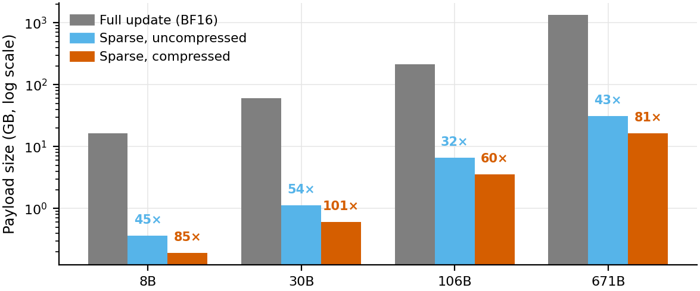
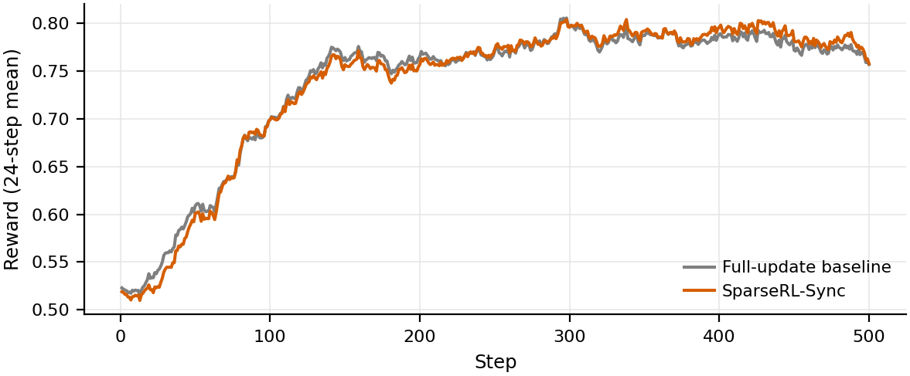

# Helix
high-performance, large-scale post-training framework including SFT and RL.

Codes will be released soon.

## Features
- 🔥 **SparseRL-sync**: reduce parameter sync size by **30x ~ 100x with 100% accuracy**, valided on models 8B ~ 671B, GRPO, DAPO, GSPO etc, generic reasoning and agentic. Check our [tech report](https://github.com/scitix/helix/blob/main/paper/sparseRL-sync.pdf)

<p align="center">
  
  
</p>

**Core result at a glance.** SparseRL-Sync reduces the Trainer-to-Rollout weight-synchronization payload by 32×–54× raw and up to ~100× after lossless compression across model scales (left) while preserving training dynamics bit-exactly (right).

- **(Left) Per-synchronization payload across model scales:** full update (BF16) vs. sparse (I, V) uncompressed vs. sparse (I, V) compressed. Sparse synchronization reduces the transfer by 32×–54× raw and ≈60×–101× after lossless compression.
- **(Right) Reward curves** of the full-update baseline vs. SparseRL-Sync on Qwen3-30B-A3B-Instruct-2507 over 500 training steps. The two curves are nearly indistinguishable, confirming lossless fidelity.


## SparseRL-Sync

This repository contains utilities for **sparse weight update tracking / synchronization** and **training-side sparse statistics**, plus a CPU-only **offline analysis** pipeline that turns dumps into **CSV/PNG** and a **`report.md` / `report.html`**.

### Repository layout

| Path | What it is |
|------|------------|
| `sparse_update/` | Python package that plugs into training/inference code (e.g., Megatron-LM / Slime / SGLang integration points). |
| `offline/` | Offline analysis. See `./offline/README.md` for details. This module's code was implemented with Cursor. |


### Environment variables

- **`SPARSE_STATS_SAVED_DIR`**: base directory for training dumps (combined with `model_tag`). See `sparse_update/megatron/statistics/statistics.py`.
- **`SPARSERL_STATE`**: selects the SparseRL operational mode consumed by `get_sparse_state()` in `sparse_update/common/utils.py`. The value is matched **case-insensitively** against these enum strings (anything else—including unset, which behaves like **`None`**—means no mode is selected):
  - **`observe`** — sparse observe only.
  - **`update`** — sparse weight update.
  - **`update_and_validate`** — update plus validation.
  - **`update_and_observe`** — update and observe concurrently.
  - **`update_and_validate_and_observe`** — all three flags true.


## Integration notes (Megatron-LM / Slime / SGLang)

### Base Env
* docker : slime-v0.2.2
* commits
    * slime: bb51bf1386a7097d6a084e4d4d973619efadfe56
    * sglang: dce8b0606c06d3a191a24c7b8cbe8e238ab316c9 + slime/docker/patch/v0.5.7/sglang.patch
    * megatron: 3714d81d418c9f1bca4594fc35f9e8289f652862(in /root/Megatron-LM) + slime/docker/patch/v0.5.7/megatron.patch

### Patch
1. add this repo-path to `PYTHONPATH`
2. apply patch in `./patch`


## Code style (Ruff)

This repository uses **[Ruff](https://docs.astral.sh/ruff/)** for linting and formatting. Configuration lives in `pyproject.toml`.

Install Ruff (recommended via `pipx`):

```bash
pipx install ruff pre-commit
```

Then, from the repo root:

```bash
ruff check --fix --preview ./
ruff format ./
```

Optional: enable pre-commit hooks:

```bash
pre-commit install
pre-commit run --all-files
```

## License
This project is licensed under the Apache License 2.0.
